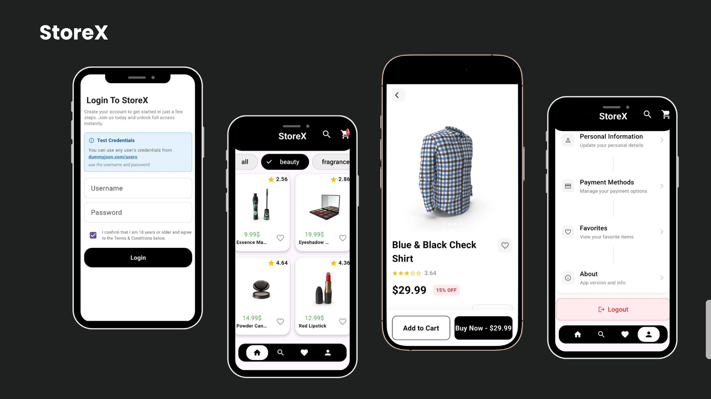
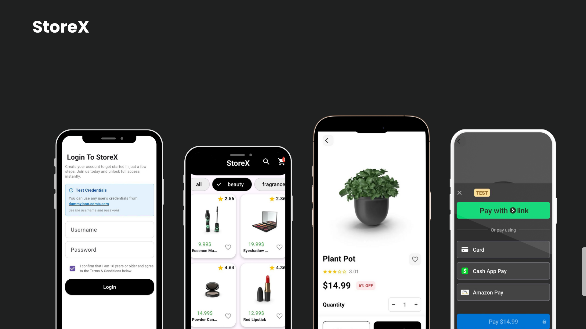
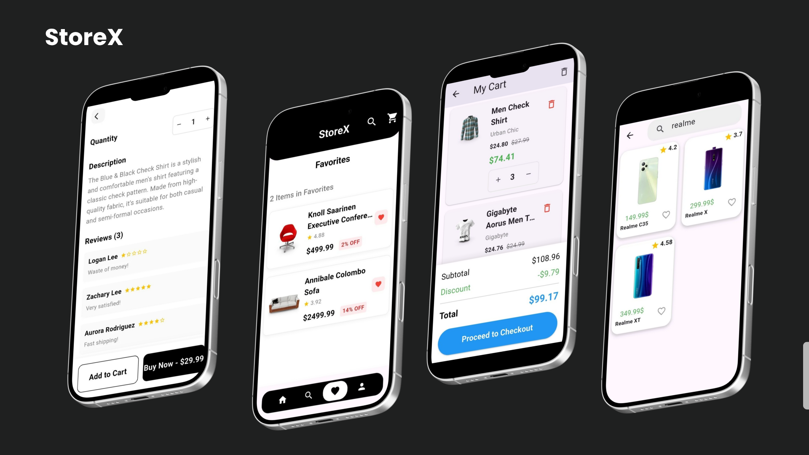

# StoreX 🛍️

A modern, feature-rich e-commerce mobile application built with Flutter. StoreX provides a seamless shopping experience with advanced features including product browsing, favorites management, secure payments, and user authentication.

## 📱 Mockups

<p align="center">
  
  
  
</p>

## ✨ Features

### 🏠 **Home & Product Discovery**
- **Category-based browsing** with 20+ product categories including smartphones, laptops, beauty, fashion, and more
- **Smart product grid** with responsive design and smooth animations
- **Product filtering** by category, price, and rating
- **Real-time search** functionality with instant results
- **Cached network images** for fast loading and offline viewing
- **Pull-to-refresh** for updating product listings

### 🔍 **Advanced Search**
- **Intelligent search** across product titles, descriptions, and brands
- **Category filtering** for refined results
- **Sort options** by price, rating, and popularity
- **Real-time search results** with instant feedback
- **Search history** and suggestions

### 🛒 **Shopping Cart**
- **Local SQLite storage** for persistent cart data
- **Add/remove products** with quantity management
- **Automatic price calculations** including discounts
- **Cart summary** with subtotal, discount, and total
- **Clear cart** functionality with confirmation dialog
- **Persistent storage** across app sessions
- **Empty cart state** with helpful prompts

### ❤️ **Favorites Management**
- **Local SQLite storage** for offline favorites access
- **Add/remove products** from favorites with one tap
- **Search and filter** favorite items
- **Persistent storage** across app sessions
- **Empty state** with engaging UI
- **Quick access** from product details and profile

### 💳 **Secure Payments**
- **Stripe integration** for secure payment processing
- **Payment Sheet** implementation for seamless checkout
- **Multiple payment methods** support (cards, digital wallets)
- **Test mode** configuration for development
- **Direct checkout** from product details or cart
- **Secure payment flow** with confirmation

### 👤 **User Authentication & Profile**
- **Login system** with session management
- **Persistent sessions** using SharedPreferences
- **Protected routes** with authentication guards
- **User profile** with personal information display
- **Profile statistics** (orders, favorites, cart items)
- **Logout functionality** with data cleanup
- **Test credentials available**: You can use any user's credentials from [dummyjson.com/users](https://dummyjson.com/users) - use the username and password for testing

### 📱 **Product Details**
- **Rich product information** including descriptions, ratings, and reviews
- **Image galleries** with smooth swiping and carousel
- **Product specifications** with dimensions and meta data
- **Quantity selector** for cart management
- **Add to favorites** functionality
- **Add to cart** with quantity selection
- **Direct purchase** integration
- **Customer reviews** with ratings and comments

### 🎨 **Modern UI/UX**
- **Responsive design** with Flutter ScreenUtil for all screen sizes
- **Floating bottom navigation** for intuitive app navigation
- **Custom animations** and smooth transitions
- **GetX Material Design** principles and best practices
- **Empty state designs** for better user experience
- **Loading states** with shimmer effects
- **Error handling** with user-friendly messages
- **Snackbar notifications** for user feedback

## 🏗️ Architecture

StoreX follows a clean, modular architecture using **GetX** for state management:

```
lib/
├── app/
│   ├── data/
│   │   ├── models/         # Data models with Freezed & JSON serialization
│   │   │   ├── cart_model/
│   │   │   ├── home_model/
│   │   │   └── user_model/
│   │   └── repositories/   # Data layer & API integration
│   │       ├── home_repo.dart
│   │       └── search_repo.dart
│   │
│   ├── modules/            # Feature modules
│   │   ├── auth/          # Authentication & user management
│   │   ├── cart/          # Shopping cart functionality
│   │   ├── details/       # Product detail pages
│   │   ├── favourite/     # Favorites management
│   │   ├── home/          # Home screen & discovery
│   │   ├── profile/       # User profile
│   │   └── search/        # Search functionality
│   │
│   ├── networking/         # API client & configuration
│   ├── routes/            # App routing configuration
│   ├── services/          # Core services
│   │   ├── base_sqlite_service.dart
│   │   ├── sqlite_cart_service.dart
│   │   ├── sqlite_favorites_service.dart
│   │   ├── stripe_payment_service.dart
│   │   └── session_service.dart
│   │
│   └── utils/             # Utilities & constants
│       ├── auth_wrapper.dart
│       ├── constant.dart
│       └── error.dart
│
└── main.dart              # App entry point
```

### Key Architecture Principles:
- **Separation of Concerns**: Clear separation between UI, business logic, and data layers
- **GetX State Management**: Reactive state management with minimal boilerplate
- **Dependency Injection**: Service locator pattern with GetX
- **Repository Pattern**: Clean data access abstraction
- **Modular Structure**: Feature-based module organization
- **Code Generation**: Freezed for immutable models, JSON serialization

## 🛠️ Technologies & Packages

### Core Dependencies:
- **Flutter SDK**: ^3.9.2
- **GetX**: ^4.7.2 - State management, routing, and dependency injection
- **Dio**: ^5.9.0 - HTTP client for API communication
- **Freezed**: ^3.2.3 - Code generation for immutable models
- **JSON Serializable**: ^6.11.1 - JSON serialization/deserialization

### Database & Storage:
- **SQFlite**: ^2.4.2 - Local SQLite database for cart and favorites
- **Shared Preferences**: ^2.2.3 - Persistent key-value storage for sessions

### UI & Design:
- **Flutter ScreenUtil**: ^5.9.3 - Responsive design across different screen sizes
- **Cached Network Image**: ^3.4.1 - Image caching and optimization
- **Floating Bottom Navigation Bar**: ^1.5.2 - Modern navigation UI

### Payments:
- **Flutter Stripe**: ^12.0.2 - Secure payment processing integration

### Utilities:
- **Dartz**: ^0.10.1 - Functional programming utilities
- **URL Launcher**: ^6.3.2 - Launch URLs and external apps
- **Path**: ^1.9.0 - File path manipulation

## 🚀 Getting Started

### Prerequisites
- Flutter SDK (3.9.2 or higher)
- Dart SDK (included with Flutter)
- Android Studio / VS Code with Flutter extensions
- iOS development tools (for Mac users)

### Installation

1. **Clone the repository**
```bash
git clone https://github.com/yourusername/store_x.git
cd store_x
```

2. **Install dependencies**
```bash
flutter pub get
```

3. **Generate code (Freezed models & JSON serialization)**
```bash
flutter pub run build_runner build --delete-conflicting-outputs
```

4. **Configure Stripe** (Optional for payment testing)
   - Get your publishable and secret keys from [Stripe Dashboard](https://dashboard.stripe.com/)
   - Update the keys in `lib/app/services/stripe_payment_service.dart`

5. **Run the app**
```bash
flutter run
```

## 📱 Running the App

### Development Mode
```bash
flutter run --debug
```

### Release Mode
```bash
flutter run --release
```

### Platform Specific
```bash
# Android
flutter run -d android

# iOS
flutter run -d ios


## 🔑 API Integration

StoreX uses the [DummyJSON API](https://dummyjson.com) for product data and authentication:

- **Base URL**: `https://dummyjson.com`
- **Products Endpoint**: `/products`
- **Search Endpoint**: `/products/search`
- **Auth Endpoint**: `/auth/login`
- **Users Data**: Available at [dummyjson.com/users](https://dummyjson.com/users)

### Test Credentials
You can use any user credentials from the DummyJSON users list. For example:
- **Username**: `emilys`
- **Password**: `emilyspass`

## 📄 License

This project is licensed under the MIT License - see the [LICENSE](LICENSE) file for details.

## 👨‍💻 Developer

**karim Mohammed**
- GitHub: [@karimMohammed912](https://github.com/karimMohammed912-gif)
- LinkedIn: [karim mohammed](https://linkedin.com/in/karim-mohammed-33bb05387)

## 🙏 Acknowledgments

- [Flutter](https://flutter.dev/) - UI framework
- [GetX](https://pub.dev/packages/get) - State management
- [DummyJSON](https://dummyjson.com) - Free fake API for testing
- [Stripe](https://stripe.com/) - Payment processing
